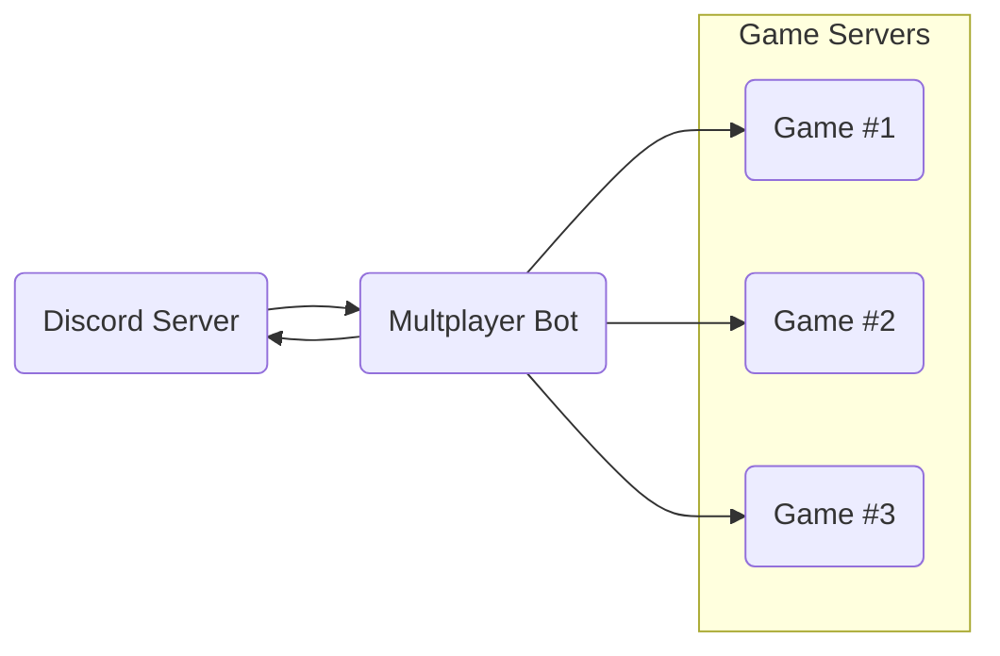

# Multiplayer game server bot

A Discord bot to manage active self-hosted dedicated game servers for our gaming
community.

## Overview

This bot was created specifically for our needs and not plug-and-play at all.

However, I thought it worth making public as an example for anyone looking
to do something similar.

### Requirements

I host a lot of the dedicated servers for a discord gaming community on my home
server. This has several benefits:

- Full control over server resources
- No monthly hosting subscriptions across various platforms
- Short of a catastrophic failure, long-running game worlds will always be
  available to players

Personally this also allows me to learn about server admin, networking, and a
great source of real-world projects like this to play around with things like
async Rust.

**`multiplayer_bot` was created because we needed an easy, hands-off way for
everyone to start and stop dedicated game servers they might want to join.**

Enter the Discord API.

<!-- Description of need, discord server, LGSM, wine, dedicated linux game servers,
etc... -->
### How it works

Since everyone uses discord to communicate, a bot that runs the right commands
on the host sever for them was the obvious choice.

This is the basic idea:



`multiplayer_bot` simply creates a client that connects to the Discord API and
listens for whatever people need.

For example, typing `/start game_1` in any chat on the discord server would spin
up the corresponding dedicated game server.

## Implementation details

### Slash commands

"Slash commands" are what people can type into any chat on the discord server
to interact with the bot.

General commands:

| Command | Description                                  |
| ------- | -------------------------------------------- |
| /help   | Show general help information                |
| /ip     | Latest public IP for connection              |
| /list   | List of available servers and current status |

Game-specific commands:

| Command           | Description                         |
| ----------------- | ----------------------------------- |
| /help    \<game\> | Help for setting up a specific game |
| /start   \<game\> | Start the server                    |
| /stop    \<game\> | Stop the server                     |
| /restart \<game\> | Restart the server                  |
| /update  \<game\> | Update the server (if possible)     |

By registering a `Command` all slash commands have autocomplete, suggestions,
and descriptions in the discord UI.

For example:

```rust
pub fn register() -> CreateCommand {
    CreateCommand::new("list").description("List current status of all servers")
}
```

This includes slash commands that have arguments, such as `/help` where the name
of a game may be given. These may be set up via the `CreateCommandOption` type.

```rust
pub fn register() -> CreateCommand {
    // Add optional "game" argument
    let mut options =
        CreateCommandOption::new(CommandOptionType::String, 
            "game", 
            "Name of the game server")
            .required(false);
        
    // Add all known games for autocomplete and suggestions
    for game in GAME_SERVERS.iter() {
        options = options.add_string_choice(game.name(), game.name())
    }

    // Finalise the help command to be registered
    CreateCommand::new("help")
        .description("Help information")
        .add_option(options)
}
```

### Host server setup

Headless linux OS, LGSM, wine, steamcmd, user spaces

#### Linux game servers

#### Windows game servers

### Tokens/identifiers

The [discord developer portal](https://discord.com/developers/docs/intro) is where the authorisation token for the bot may be set. Go to `Applications>Bot>Token` and regenerate if you lost it. The client must be initialised, which I have stored in `BOT_TOKEN` (read from an environment variable on the host).

```rust
    // build the client
    let mut client = Client::builder(tokens::BOT_TOKEN.as_str(), GatewayIntents::empty())
        .event_handler(events::Handler)
        .await
        .expect("Error creating client");
```

The only other identifiers needed are the server or "guild" ID of the discord server you want to add the bot to, and for any particular role or members you want permissions control over.

In this case:

- Guild ID is used to add slash commands and autocomplete

    ```rust
        // Register slash commands to the guild
        let commands = &tokens::GUILD_ID
            .set_commands(
                &ctx.http,
                vec![
                    commands::help::register(),
                    commands::ip::register(),
                    commands::list::register(),
                    commands::restart::register(),
                    commands::start::register(),
                    commands::stop::register(),
                    commands::update::register(),
                ],
            )
            .await;
    ```

- Role ID is used to limit bot use to trusted members

    ```rust
    /// Check to see if the user belongs to the trusted role
    fn is_trusted_member(command: &CommandInteraction) -> bool {
        if let Some(member) = command.member.as_ref() {
            member.roles.contains(&tokens::TRUSTED_ROLE_ID)
        } else {
            false
        }
    }
    ```

### Implementation

`GameServer` trait, `GAME_SERVERS` array, async rust

## Work-in-progress

- Implement a logger
- Clean up code and document in detail
- Remove command clone workaround
