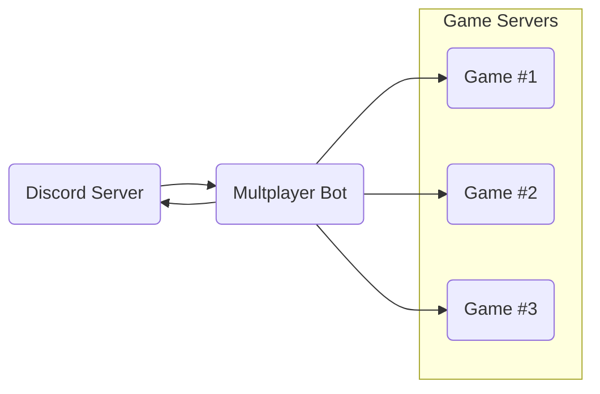

# Multiplayer game server bot

A Discord bot to manage active self-hosted dedicated game servers for our gaming
community.

## Overview

This bot was created specifically for our needs and not plug-and-play at all.

However, I thought it worth making public as an example for anyone looking
to do something similar.

### Requirements

I host a lot of the dedicated servers for a discord gaming community on my home
server. This has several benefits:

- Full control over server resources
- No monthly hosting subscriptions across various platforms
- Short of a catastrophic failure, long-running game worlds will always be
  available to players

Personally this also allows me to learn about server admin, networking, and a
great source of real-world projects like this to play around with things like
async Rust.

**`multiplayer_bot` was created because we needed an easy, hands-off way for
everyone to start and stop dedicated game servers they might want to join.**

Enter the Discord API.

<!-- Description of need, discord server, LGSM, wine, dedicated linux game servers,
etc... -->
### How it works

Since everyone uses discord to communicate, a bot that runs the right commands
on the host sever for them was the obvious choice.

This is the basic idea:

`multiplayer_bot` simply creates a client that connects to the Discord API and
listens for whatever people need.

For example, typing `/start game_1` in any chat on the discord server would spin
up the corresponding dedicated game server.

## Implementation details

### Host server setup

Headless linux OS, LGSM, wine, steamcmd, user spaces

### Slash commands

### Tokens

Tokens setup for the discord developer portal and guilds, etc...

### Implementation

`GameServer` trait, `GAME_SERVERS` array, async rust

## Work-in-progress

- Implement a logger
- Clean up code and document in detail
- Remove command clone workaround
