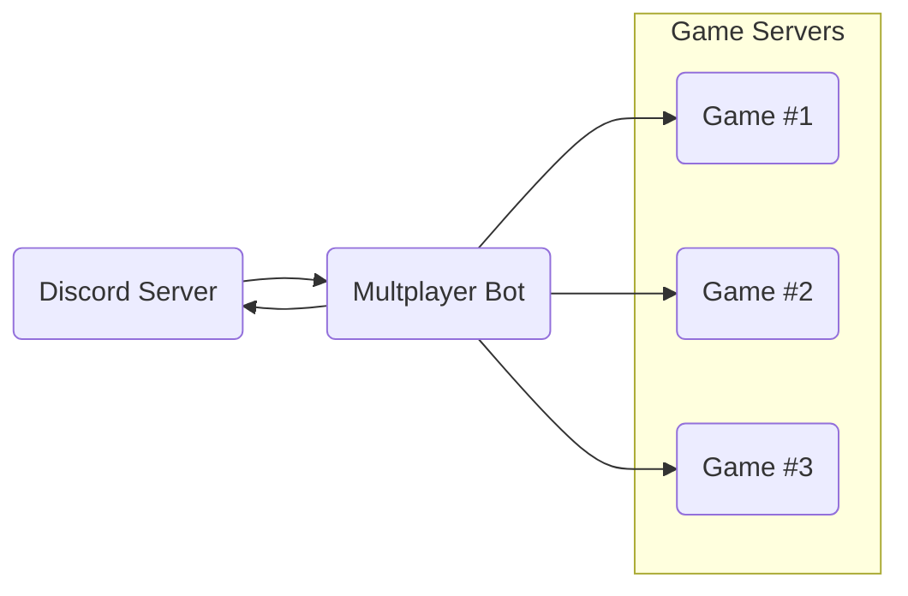

# Multiplayer game server bot

A Discord bot to manage active self-hosted dedicated game servers for our gaming
community.


## Overview

This bot was created specifically for our needs and not plug-and-play at all.

However, I thought it worth making public as an example for anyone looking
to do something similar.

### Requirements

I host a lot of the dedicated servers for a discord gaming community on my home
server. This has several benefits:

- Full control over server resources
- No monthly hosting subscriptions across various platforms
- Short of a catastrophic failure, long-running game worlds will always be
  available to players

Personally this also allows me to learn about server admin, networking, and a
great source of real-world projects like this to play around with things like
async Rust.

**`multiplayer_bot` was created because we needed an easy, hands-off way for
everyone to start and stop dedicated game servers they might want to join.**

Enter the Discord API.

<!-- Description of need, discord server, LGSM, wine, dedicated linux game servers,
etc... -->
### How it works

Since everyone uses discord to communicate, a bot that runs the right commands
on the host sever for them was the obvious choice.

This is the basic idea:



`multiplayer_bot` simply creates a client that connects to the Discord API and
listens for whatever people need.

For example, typing `/start game_1` in any chat on the discord server would spin
up the corresponding dedicated game server.

## Implementation details

### Slash commands

"Slash commands" are what people can type into any chat on the discord server
to interact with the bot.

General commands:

| Command | Description                                  |
| ------- | -------------------------------------------- |
| /help   | Show general help information                |
| /ip     | Latest public IP for connection              |
| /list   | List of available servers and current status |

Game-specific commands:

| Command           | Description                         |
| ----------------- | ----------------------------------- |
| /help    \<game\> | Help for setting up a specific game |
| /start   \<game\> | Start the server                    |
| /stop    \<game\> | Stop the server                     |
| /restart \<game\> | Restart the server                  |
| /update  \<game\> | Update the server (if possible)     |

By registering a `Command` all slash commands have autocomplete, suggestions,
and descriptions in the discord UI. It looks something like this for people to cklick on or `tab` to autocomplete:


For example:

```rust
pub fn register() -> CreateCommand {
    CreateCommand::new("list").description("List current status of all servers")
}
```

This includes slash commands that have arguments, such as `/help` where the name
of a game may be given. These may be set up via the `CreateCommandOption` type.

```rust
pub fn register() -> CreateCommand {
    // Add optional "game" argument
    let mut options =
        CreateCommandOption::new(CommandOptionType::String, 
            "game", 
            "Name of the game server")
            .required(false);
        
    // Add all known games for autocomplete and suggestions
    for game in GAME_SERVERS.iter() {
        options = options.add_string_choice(game.name(), game.name())
    }

    // Finalise the help command to be registered
    CreateCommand::new("help")
        .description("Help information")
        .add_option(options)
}
```

### Host server setup

The home server runs a headless ubuntu OS, and every game server is managed user a new user. This is good to do for several reasons:

- Game servers are self-contained with their own user environment
- Permissions may be extremely limited to prevent access to other user data or other important server configs
- Scalable to many games without becoming a complete mess

The approach differs for the type of dedicated game server, but essentially all the bot does is run the relevant `start`/`stop`/`etc...` command as the appropriate user. Note that the bot itself must be run by a separate managing user with access to every game server user.

#### Linux game servers

Where possible, the [Linux Game Server Manager (LGSM)](https://linuxgsm.com) is used to make everything extremely easy.

This provides a single point of control, with the following fully implemented:

- start
- stop
- restart
- update
- backup

Along with several other management commands. Since this is consistent between all LGSM servers the bot only needs to call this.

For example:

``` bash
# Discord command
/start minecraft    

# Bot runs (as the "minecraft" user)
/home/mincraft/mcserver start
```

Simple.

Servers not available through LGSM need to be set up differently. I use `tmux` as the easiest way of starting and stopping a game server in a detached terminal.

Now the slash commands trigger a `tmux` session as needed:

| Command           | Host server side                                          |
| ----------------- | --------------------------------------------------------- |
| /start   \<game\> | `tmux new-session -d -s <session_name> <game_executable>` |
| /stop    \<game\> | `tmux kill-session -t <session_name>`                     |
| /restart \<game\> | `tmux kill-session` followed by `tmux new-session`        |
| /update  \<game\> | `/usr/games/steamcmd` with relevant update arguments      |

#### Windows game servers

Windows-based game servers are insane to me, but some games insist on it.

The only difference to the manual `tmux` method used for the linux game servers are that:

- The wine executable path is pre=prended to  (`/usr/bin/wine`)
- `steamcmd` uses the `+@sSteamCmdForcePlatformType windows` argument for updates

Wine ([Wine Is Not an Emulator](https://www.winehq.org/)) is a compatibility layer capable of running dumbass Windows-only applications where they shouldn't be, like on Linux or MacOS.

```shell
# install (obviously look up your platform)
sudo apt install wine64

# run the setup
wine setup.exe
```

Enshrouded and Space Engineers are examples of this, where the executable is run with wine for compatibility.

``` bash
# Discord command
/start enshrouded    

# Bot runs (as the "enshrouded" user)
/usr/bin/wine /path/to/enshrouded_server.exe 
```

### Tokens/identifiers

The [discord developer portal](https://discord.com/developers/docs/intro) is where the authorisation token for the bot may be set. Go to `Applications>Bot>Token` and regenerate if you lost it. The client must be initialised, which I have stored in `BOT_TOKEN` (read from an environment variable on the host).

```rust
    // build the client
    let mut client = Client::builder(tokens::BOT_TOKEN.as_str(), GatewayIntents::empty())
        .event_handler(events::Handler)
        .await
        .expect("Error creating client");
```

The only other identifiers needed are the server or "guild" ID of the discord server you want to add the bot to, and for any particular role or members you want permissions control over.

In this case:

- Guild ID is used to add slash commands and autocomplete

    ```rust
        // Register slash commands to the guild
        let commands = &tokens::GUILD_ID
            .set_commands(
                &ctx.http,
                vec![
                    commands::help::register(),
                    commands::ip::register(),
                    commands::list::register(),
                    commands::restart::register(),
                    commands::start::register(),
                    commands::stop::register(),
                    commands::update::register(),
                ],
            )
            .await;
    ```

- Role ID is used to limit bot use to trusted members

    ```rust
    /// Check to see if the user belongs to the trusted role
    fn is_trusted_member(command: &CommandInteraction) -> bool {
        if let Some(member) = command.member.as_ref() {
            member.roles.contains(&tokens::TRUSTED_ROLE_ID)
        } else {
            false
        }
    }
    ```

### Adding new games

While not the cleanest implementation, it is fairly simple to add to and more than good enough for our needs.

1. When a new game server is set up, a new file is added to `src/games/`. For example `new_game.rs`.

2. Inside `new_game.rs` a structure to represent the game server config, e.g. `Server`. This must implement the `GameServer` trait at a minimum.

    ```rust
    pub trait GameServer: Send + Sync {
        fn new() -> Self
        where
            Self: Sized;
        fn name(&self) -> &str;
        fn description(&self) -> &str;
        fn port(&self) -> u16;
        fn help_message(&self) -> String;
        fn start(&self) -> String;
        fn stop(&self) -> String;
        fn restart(&self) -> String;
        fn update(&self) -> String;
        fn status(&self) -> String;
    }
    ```

    Most dont need to do anything, but in general they simply run a command on the host server and return a message to post in discord.

3. Add the new config to the list of games you want to make available to the discord server

    ```rust
    /// Array of all game servers to add to the manager
    pub static GAME_SERVERS: LazyLock<[Box<dyn GameServer>; 4]> = LazyLock::new(|| {
        [
            Box::new(game_1::Server::new()),
            Box::new(game_2::Server::new()),
            Box::new(game_3::Server::new()),
            Box::new(new_game::Server::new()), // <-- new game server
        ]
    });
    ```

    Why make it lazy? who knows, this was written one weekend in a bit of an async-related haze. I'll make it just a normal static at some point.

## Work-in-progress

- Implement a logger
- Get rid of the lazylock game servers
- Clean up code and document in detail
- Remove command clone workaround
